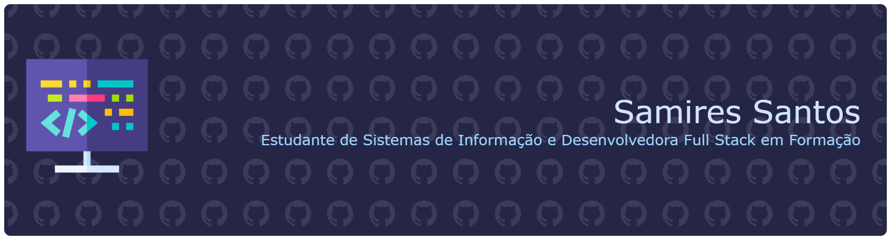

  

🚀 Atualmente desenvolvo aplicações web com **React, Node.js, Java, Python, JavaScript e MySQL**, buscando sempre aprender novas tecnologias e criar soluções bem estruturadas para problemas reais.

---

## GitHub Activity

  
  

---

## Tech Stack

  

---

 <i>Always learning. Always building.</i> 

